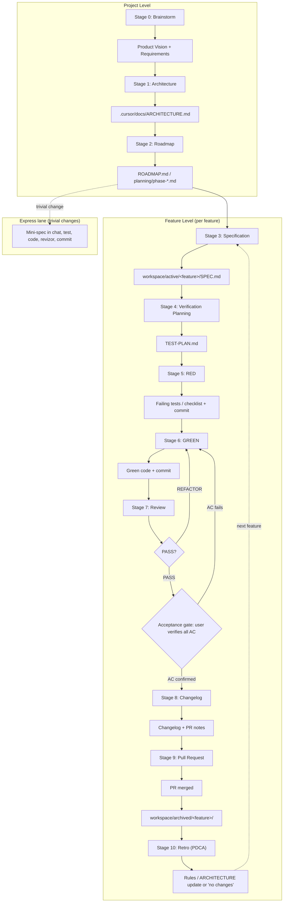

# AiDD Workflow 2.0

A practical development process for a **solo developer** using AI agents (Cursor, Claude Code, Codex, and similar tools).

## Principles

1. **One stage — one chat.** Do not combine brainstorm, spec, tests, and implementation in a single session — context gets noisy and the agent “remembers” outdated decisions.
2. **Artifacts live in the workspace, not in the agent’s head.** Each chat receives `@` references to input files and leaves one output document or commit.
3. **You decide; the agent structures.** At Spec and Architecture stages you approve scope; the agent does not expand the feature on its own.
4. **Minimal custom infrastructure, mandatory objective gates.** Git, markdown in `.cursor/`, project rules, subagents — no audit DB or forced approve scripts. BUT automated gates are non-negotiable: husky pre-commit / pre-push (lint, typecheck, changed tests) and CI when available. Gates provide evidence independent of agent claims.
5. **Verification before implementation.** RED (tests / checklists) before GREEN (production code).

## Artifact structure

```text
.cursor/
├── docs/
│   ├── ARCHITECTURE.md          # Stage 1 — stack and project rules
│   ├── WORKFLOW.md              # this document
│   ├── ROADMAP.md               # Stage 2 (small project)
│   ├── planning/                # Stage 2 (large project)
│   │   ├── ROADMAP.md
│   │   └── phase-*.md
│   └── templates/
│       ├── SPEC-template.md
│       ├── TEST-PLAN-template.md
│       ├── MANUAL-CHECKLIST-template.md
│       ├── ARCHITECTURE-template.md
│       └── husky/
│           ├── pre-commit       # lint-staged + check + test:changed
│           └── pre-push         # e2e when specs exist
├── workspace/
│   ├── active/
│   │   └── <feature>/
│   │       ├── SPEC.md              # Stage 3
│   │       ├── SPEC-REVIEW.md       # Stage 3.5 (optional)
│   │       ├── TEST-PLAN.md         # Stage 4
│   │       ├── TEST-PLAN-REVIEW.md  # Stage 4.5 (optional)
│   │       ├── MANUAL-CHECKLIST.md  # Stage 5 RED (when manual scenarios exist)
│   │       └── REVIZOR-REVIEW.md    # Stage 7
│   └── archived/
│       └── <feature>/           # after PR merge
├── plans/                       # Optional (Plan Mode creation)
├── rules/
│   ├── anti-over-engineering.md # RED/GREEN discipline (Stage 5–6)
│   ├── spec-patterns-by-layer.md # reusable SPEC patterns for pure modules (Stage 3)
│   └── tech-stack-*.md          # stack rules (Stage 1, Stage 6)
└── agents/
    ├── specify.md               # Stage 3 — specification
    ├── spec-reviewer.md         # Stage 3.5 — SPEC review (optional)
    ├── test-plan.md             # Stage 4 — verification planning
    ├── test-plan-reviewer.md    # Stage 4.5 — TEST-PLAN review (optional)
    └── revizor.md               # Stage 7 — review
```

After the PR is merged, move `.cursor/workspace/active/<feature>/` → `.cursor/workspace/archived/<feature>/`. Long-term context also lives in git (commits, PR).

---

# Project Level

Once per project (or on a major pivot). Each stage — **new chat**.

---

## Stage 0 — Brainstorm

| | |
|---|---|
| **Goal** | Shape the product idea, core features, risks, and unknowns |
| **Input** | Idea / problem in free form; notes; competitor references (optional) |
| **Output** | **Product Vision** (1–2 pages) + **Initial Requirements** (bullet list) |
| **Agent** | Regular Chat / Ask mode — agent asks questions, you answer |
| **Done when** | Clear *who* and *what*; must-have vs nice-to-have list; top 3 risks; explicit open questions |

**Practice**

- No code and no framework choices — product only.
- Capture vision in `.cursor/docs/PRODUCT-VISION.md` or in the first section of the future `ARCHITECTURE.md`.
- If the idea is still raw — stop here; do not move to Stage 1.

**Handoff to the next chat**

```markdown
@.cursor/docs/PRODUCT-VISION.md (or your notes)
Draft ARCHITECTURE.md per Stage 1 of WORKFLOW.
```

---

## Stage 1 — Architecture

| | |
|---|---|
| **Goal** | Create and fill `ARCHITECTURE.md` — single source of technical project rules |
| **Input** | Product Vision, Initial Requirements |
| **Output** | `.cursor/docs/ARCHITECTURE.md` |
| **Agent** | Agent mode with `@ARCHITECTURE.md` (draft) + matching **tech-stack rule** from `.cursor/rules/` |
| **Done when** | Document covers all sections below; you read it and say **“architecture frozen”** |

**`ARCHITECTURE.md` must include**

| Section | Content |
|---------|---------|
| Tech stack | Languages, runtime, build, deploy |
| Architectural principles | Layers, dependencies, no circular deps |
| Directory structure | Folder tree and purpose |
| Naming conventions | Files, variables, components, WP hooks |
| Allowed libraries | Whitelist with rationale |
| Forbidden libraries | Blacklist (frameworks, duplicate utilities) |
| Security | Secrets, escaping, auth, CORS, nonces |
| Testing standards | Unit / integration / E2E / manual — when to use each |
| API rules | REST/GraphQL, errors, versioning, mocking |
| Database rules | Migrations, ORM/raw SQL, indexes |
| Coding style | Lint, format, comments (English) |
| Technical constraints | Browser targets, Node version, hosting limits |

**Practice**

- Copy template: `.cursor/docs/templates/ARCHITECTURE-template.md` → `.cursor/docs/ARCHITECTURE.md`, then fill it in.
- Attach one stack rule: `tech-stack-vanilla-js`, `tech-stack-astro-js`, `tech-stack-wp-classic-theme`, or `tech-stack-wp-plugin`.
- Do not duplicate the entire rule in ARCHITECTURE — reference it and add project-specific exceptions only.
- Set up husky gates from templates: `npm i -D husky lint-staged`, `npx husky init`, then copy `.cursor/docs/templates/husky/pre-commit` and `.cursor/docs/templates/husky/pre-push` into `.husky/`.

---

## Stage 2 — Roadmap Planning

| | |
|---|---|
| **Goal** | Build an implementation plan: phases, dependencies, MVP, work order |
| **Input** | `@.cursor/docs/ARCHITECTURE.md`, Product Vision |
| **Output** | Roadmap (see structure below) |
| **Agent** | Plan mode or Agent with CreatePlan — no code |
| **Done when** | MVP scope defined; features ordered; dependencies marked; you approved the sequence |

**Where to store**

| Project size | Path |
|--------------|------|
| Small / solo | `.cursor/docs/ROADMAP.md` |
| Large / many phases | `.cursor/docs/planning/ROADMAP.md` + `.cursor/docs/planning/phase-*.md` |

**Roadmap must include**

- Phases or milestones with approximate dates
- Feature dependencies (blockers)
- **MVP** — minimum set for release
- Implementation order (for solo work this is a sequence)
- Links to future `workspace/active/<feature>/`

**Practice**

- One roadmap feature ≈ one future Feature Level cycle (Stage 3–10).
- Do not write tests here — only *what* to build and in what order.

---

# Feature Level

For **each feature** from the roadmap — a separate Stage 3 → 10 cycle. Each stage — **new chat** (except Stage 6, where you may use several short chats per slice).

### Stage commit discipline (Stages 3–8)

Every completed stage (and each REVISE/REFACTOR round that must stay in git) leaves a **conventional commit** on `spec/<feature>`. This is for *in-flight* audit — bisect, rollback, chat handoff. Stage 9 squash-merge collapses these onto the base branch (see Stage 9).

| Stage | Message pattern | Paths |
|-------|-----------------|-------|
| 3 | `docs(<f>): draft SPEC` / after freeze `docs(<f>): freeze SPEC` | `active/<f>/SPEC.md` |
| 3.5 | `docs(<f>): SPEC-REVIEW <APPROVE\|REVISE>` | `SPEC-REVIEW.md` (+ SPEC if Fix applied) |
| 4 | `docs(<f>): draft TEST-PLAN` / `docs(<f>): freeze TEST-PLAN` | `TEST-PLAN.md` |
| 4.5 | `docs(<f>): TEST-PLAN-REVIEW <APPROVE\|REVISE>` | `TEST-PLAN-REVIEW.md` |
| 5 | `test(<f>): RED <slice-id> failing specs` | tests + optional `MANUAL-CHECKLIST.md` |
| 6 | `feat(<f>): GREEN <slice-id> …` | production (+ sibling test updates if supersedence) |
| 7 | `docs(<f>): REVIZOR <PASS\|REFACTOR>` | `REVIZOR-REVIEW.md` |
| 8 | `docs(<f>): changelog + PR-DRAFT` | `CHANGELOG.md`, `PR-DRAFT.md` |

**Practice:** Conductor **auto-commits** after **every** subagent/step — including each REVISE round — before the next Task (status line includes short SHA). Manual one-stage chats treat the matching commit as part of **Done when**. Workflow/tooling edits stay on a **separate** branch from the feature being conducted.

---

## Stage 3 — Specification

| | |
|---|---|
| **Goal** | Create a SPEC for one feature — contract for *what we build* |
| **Input** | `@.cursor/docs/ARCHITECTURE.md`, `@.cursor/docs/ROADMAP.md` (or phase doc), module docs if any |
| **Output** | `.cursor/workspace/active/<feature>/SPEC.md`; **commit** per stage commit discipline |
| **Agent** | Subagent **specify** (`.cursor/agents/specify.md`) or Agent + `@SPEC-template.md` |
| **Done when** | SPEC is complete; open questions closed or explicitly deferred; you wrote **“spec frozen”**; freeze commit created |

**SPEC must include**

| Section | Content |
|---------|---------|
| Goal | One sentence — why this feature exists |
| Requirements | Functional requirements (numbered list) |
| Acceptance Criteria | Verifiable “done” conditions |
| Edge Cases | Known boundary cases |
| Out of Scope | What we deliberately skip in this feature |
| Local Constraints | Env, API, browser, WP capabilities — from ARCHITECTURE |
| Open Questions | TBD with owner (you) |

**Practice**

- Copy template: `.cursor/docs/templates/SPEC-template.md` → `.cursor/workspace/active/<feature>/SPEC.md`.
- After each SPEC draft or revision: `npm run spec:validate -- <feature>` (see `.cursor/tools/spec-validate/README.md`). `@specify` must fix all linter **errors** before presenting the draft.
- **Pure-module features** (`src/domain|state|persist/**`): apply [spec-patterns-by-layer.md](../rules/spec-patterns-by-layer.md) and reuse the nearest archived sibling SPEC so the first draft carries the boundary / export / purity invariants — this is what historically drove repeated Stage 3.5 REVISE rounds. Resolve contract-defining questions (module path, result shape) **before** review, not after.
- Agent proposes — you decide scope. Do not start Stage 4 without a frozen spec.
- Optional **Stage 3.5** before you write **"spec frozen"** (see below).

---

## Stage 3.5 — SPEC Review (optional)

| | |
|---|---|
| **Goal** | Independent audit of draft SPEC before freeze |
| **Input** | `@SPEC.md` (draft), `@ARCHITECTURE.md`, `@ROADMAP.md` (or phase doc) |
| **Output** | `.cursor/workspace/active/<feature>/SPEC-REVIEW.md` — **APPROVE** or **REVISE** + findings + FR→AC→EC matrix; **commit** |
| **Agent** | Subagent **spec-reviewer** (`.cursor/agents/spec-reviewer.md`) — **new chat**; `@specify` does not review its own draft |
| **Done when** | Report file written; commit created (`docs(<f>): SPEC-REVIEW …`); on APPROVE you may freeze; on REVISE → new Stage 3 chat with the Fix list |

**Practice**

- Run `npm run spec:validate -- <feature>` first; reviewer focuses on scope, roadmap, and prose the linter cannot check.
- Copy shape from `.cursor/docs/templates/SPEC-REVIEW-template.md` (agent writes the file).
- Report file holds the **latest** round only (overwrite). Commit between rounds if you need prior REVISE in git.
- No verdict in chat without the report file written.

---

## Stage 4 — Verification Planning

| | |
|---|---|
| **Goal** | Define the *full* verification strategy for the feature **before** production code |
| **Input** | `@.cursor/workspace/active/<feature>/SPEC.md`, `@.cursor/docs/ARCHITECTURE.md` (Testing section) |
| **Output** | `.cursor/workspace/active/<feature>/TEST-PLAN.md`; **commit** per stage commit discipline |
| **Agent** | Subagent **test-plan** (`.cursor/agents/test-plan.md`) or Agent + `@TEST-PLAN-template.md` |
| **Done when** | Every acceptance criterion from SPEC has at least one scenario; auto vs manual decided; you wrote **“test plan frozen”**; freeze commit created |

The agent must decide: **what** to verify, **how** (tool), and **what level of automation** is appropriate.

### Check types

| Type | When to use | Examples |
|------|-------------|----------|
| **Unit** | Pure functions, business logic without I/O | normalize, validate, calculate |
| **Integration** | Modules + store, API, CMS, Shopify, WP | REST client + handler, ACF mapper |
| **E2E** | Critical user flows in the browser | login, checkout, form submit, search |
| **Manual / QA** | Hard to automate; admin UIs | WP admin, visual review, content entry |
| **Non-functional** | perf, security, a11y, compatibility | Lighthouse, axe, load smoke |

### `TEST-PLAN.md` must include

- Scenario table: ID, description, category, priority (P0/P1/P2)
- What is **automated** (test file / spec) vs **manual checklist**
- Edge cases and **negative** scenarios (network errors, empty data, deny permission, invalid input)
- “Done” criteria for Stage 5–6 (all P0 must be green)
- Out of scope for testing in this slice

**Practice**

- Copy template: `.cursor/docs/templates/TEST-PLAN-template.md` → `.cursor/workspace/active/<feature>/TEST-PLAN.md`.
- Mandatory **YAML front matter** (`slices`, `manualChecklist`, `doneCriteria`) — machine-readable contract for Stage 6 GREEN; full schema in the agent and template, not duplicated here.
- Agent proposes — you freeze. Do not start RED without a frozen TEST-PLAN.
- No code in this chat — plan only.
- P0 = blocks GREEN; P1 = desirable in the same PR; P2 = can defer (note in SPEC out of scope or backlog).
- Optional **Stage 4.5** before you write **"test plan frozen"** (see below).

---

## Stage 4.5 — TEST-PLAN Review (optional)

| | |
|---|---|
| **Goal** | Independent audit of draft TEST-PLAN before freeze / RED |
| **Input** | `@TEST-PLAN.md` (draft), `@SPEC.md` (frozen), `@ARCHITECTURE.md` |
| **Output** | `.cursor/workspace/active/<feature>/TEST-PLAN-REVIEW.md` — **APPROVE** or **REVISE** + findings + AC→scenario matrix; **commit** |
| **Agent** | Subagent **test-plan-reviewer** (`.cursor/agents/test-plan-reviewer.md`) — **new chat**; Stage 4 author does not review their own plan |
| **Done when** | Report file written; commit created (`docs(<f>): TEST-PLAN-REVIEW …`); on APPROVE you may freeze; on REVISE → new Stage 4 chat with the Fix list |

**Practice**

- Copy shape from `.cursor/docs/templates/TEST-PLAN-REVIEW-template.md` (agent writes the file).
- Report file holds the **latest** round only (overwrite). Commit between rounds if you need prior REVISE in git.
- No verdict in chat without the report file written.

**Handoff to the next chat**

```markdown
## Handoff — Stage 5 (RED)
@.cursor/workspace/active/<feature>/TEST-PLAN.md
@.cursor/workspace/active/<feature>/SPEC.md
@.cursor/docs/ARCHITECTURE.md
@.cursor/rules/anti-over-engineering.md
@.cursor/docs/templates/MANUAL-CHECKLIST-template.md

Implement RED only per TEST-PLAN §7. Create MANUAL-CHECKLIST.md from §5 if manual scenarios exist.
```

---

## Stage 5 — RED Phase

| | |
|---|---|
| **Goal** | Prove missing implementation: failing tests or executable checklist |
| **Input** | `@TEST-PLAN.md`, `@SPEC.md`, `@ARCHITECTURE.md` (testing + stack rule) |
| **Output** | Automated tests and/or `MANUAL-CHECKLIST.md` (created from TEST-PLAN §5); **commit tests/checklists only** |
| **Agent** | Agent mode; rule `anti-over-engineering.md` — **no production code** for new behavior |
| **Done when** | P0 automated tests fail for the **expected** reason; manual items marked “not implemented”; RED commit created (`test(<f>): RED …`) |

**Order**

1. Implement automated tests from TEST-PLAN §7 (unit → integration → e2e by priority).
2. If TEST-PLAN §5 has manual scenarios, create `MANUAL-CHECKLIST.md` from §5 (copy `.cursor/docs/templates/MANUAL-CHECKLIST-template.md` if helpful); items marked **not implemented**.
3. Run checks (`npm test`, `playwright test`, etc. — per ARCHITECTURE).
4. Confirm RED state is documented (screenshot / log in chat is enough).

**Commit message (example)**

```text
test(<feature>): add failing specs per TEST-PLAN
```

**Practice**

- One logical block of tests per commit — easier review and bisect.
- If pre-commit blocks red tests — `git commit --no-verify` **deliberately**, with explanation in the message.
- New chat for RED if Stage 4 was long — handoff: `@TEST-PLAN.md` + “implement RED only”.

---

## Stage 6 — GREEN Phase

| | |
|---|---|
| **Goal** | Implement the feature with minimal code so P0 checks pass |
| **Input** | `@SPEC.md`, `@TEST-PLAN.md`, `@` failing test files, stack rule, `anti-over-engineering.md` |
| **Output** | Production code; **GREEN state**; commit(s) |
| **Agent** | Agent mode; one failing test / one slice at a time |
| **Done when** | All P0 automated tests green; P0 manual checklist done; SPEC acceptance criteria met; GREEN commit(s) created |

**Order**

1. Follow `slices[]` in TEST-PLAN YAML front matter — one slice at a time; `targetFiles` and `doneWhen` define scope and completion. Short plan in chat (or CreatePlan) if helpful.
2. Green: simplest code in the **existing module** (no new files in Green — see anti-over-engineering).
3. Run all P0 checks.
4. Commit after each slice or logical cluster.

**Commit message (example)**

```text
feat(<feature>): implement <behavior> — green P0 tests
```

**Refactor within GREEN**

- Small behavior-preserving edits are allowed if tests are untouched.
- Structural refactor (new files, extract) — end of Stage 6 after green, or a separate short chat with the same tests.

**Practice**

- Do not bundle unrelated features in one commit.
- Keep the active feature branch scoped to that feature — land unrelated workflow/tooling/docs on a separate branch (or `master`) first so they do not pollute the PR diff or Stage 7 review scope.
- When TEST-PLAN §1.1 lists **sibling test files** to update (supersedence), edit those files in the **same** GREEN slice that introduces the superseding behaviour — same PR, not a follow-up.
- When adding a new `data-js` hook under an existing view (list, card, …), extend that view’s `clear*Markup` / leave-view path in `main.js` in the **same** GREEN slice, and assert the hook is absent after navigation in a bootstrap scenario (orphaned controls otherwise stay clickable).
- When SPEC names a **visual direction** (e.g. Soft Material light UI), GREEN must apply that direction to shipped surfaces — page/surface backgrounds, spacing, primary vs secondary controls, readable type — not only the minimal selectors needed to green CSS-contract unit tests. Pixel-perfection remains out of scope; bare unstyled chrome with a token checklist is not done.
- If TEST-PLAN requires E2E — green unit/integration first, then e2e in the same stage or a separate slice.

---

## Stage 7 — Review

| | |
|---|---|
| **Goal** | Independent, evidence-based review by a **different** agent / chat, then user acceptance |
| **Input** | Diff of recent commit(s) or `@` changed files + `@SPEC.md` + `@TEST-PLAN.md` + `@ARCHITECTURE.md` |
| **Output** | `.cursor/workspace/active/<feature>/REVIZOR-REVIEW.md` — **PASS** or **REFACTOR** + findings + traceability matrix + plain-language summary; **commit** |
| **Agent** | Subagent **revizor** (`.cursor/agents/revizor.md`) — **new chat**; implementer does not review themselves |
| **Done when** | `REVIZOR-REVIEW.md` written with PASS, full `npm test` + `npm run check` recorded green, review commit created, **and** you personally confirmed every Acceptance Criterion (acceptance gate below) |

**Check**

| Area | Question |
|------|----------|
| Architecture | Stack violations, forbidden libs, folder structure |
| SPEC | Scope implemented; out of scope not bloated |
| TEST-PLAN | P0 covered; negatives not ignored; sibling supersedence files updated if listed |
| Code quality | Readability, duplication, ghost code |
| Security | Escaping, secrets, auth |
| Performance | Obvious N+1, redundant requests |
| Typing | `any` without justification |
| Test quality | Behavior tests, not implementation details |
| Full suite | **`npm test`** (entire unit suite) green — feature-only Vitest is never enough for PASS |
| Tooling gate | **`npm run check`** green (format / lint / typecheck per project) |

**Evidence requirements (revizor)**

- Every finding must cite: **file + line + concrete scenario** (how to reproduce / observe the issue) + the **violated rule** (ARCHITECTURE section, project rule, or SPEC item). No citation — no finding.
- Mandatory **traceability matrix**: each AC from SPEC → TEST-PLAN scenario → test file. Any gap = **REFACTOR**.
- Mandatory **regression / full-suite evidence**: cite `npm test` and `npm run check` commands + pass summary in `REVIZOR-REVIEW.md`. Missing or red suite = **REFACTOR**.
- **Plain-language summary** for the process owner: each finding explained in one jargon-free sentence.

**Practice**

- Copy shape from `.cursor/docs/templates/REVIZOR-REVIEW-template.md` (agent writes the file).
- Report file holds the **latest** round only (overwrite). Commit between rounds if you need prior REFACTOR in git (`docs(<f>): REVIZOR …`).
- No verdict in chat without the report file written.
- On REFACTOR, paste findings from `@REVIZOR-REVIEW.md` into a **new Stage 6 chat**.
- Until project CI runs the suite on every PR, treat **local** `npm test` + `npm run check` as the real gates — Netlify deploy preview green is not suite green.

**Acceptance gate (mandatory, after revizor PASS)**

- Confirm revizor PASS already recorded **full-suite** green (`npm test` + `npm run check`) in `REVIZOR-REVIEW.md`.
- You personally walk through **every Acceptance Criterion** from SPEC by *using* the feature — behavior-level check, no code reading.
- Any AC that fails or cannot be exercised → back to Stage 6 with a description of what you saw.
- Only revizor PASS (in `REVIZOR-REVIEW.md`) + your AC confirmation unlocks Stage 8.

**On REFACTOR**

1. New Stage 6 chat with `@REVIZOR-REVIEW.md` / the findings list (do not continue the review chat).
2. After fixes — Stage 7 again.

---

## Stage 8 — Changelog

| | |
|---|---|
| **Goal** | Short human-readable summary of changes |
| **Input** | `@SPEC.md`, git log / feature diff, `@REVIZOR-REVIEW.md` (if any) |
| **Output** | Changelog entry + PR description draft; **commit** (`docs(<f>): changelog + PR-DRAFT`) |
| **Agent** | Quick Chat / Agent — no code changes |
| **Done when** | User-facing description exists; breaking changes noted; known limitations listed; Stage 8 commit created |

**Where to store**

- `CHANGELOG.md` (Keep a Changelog format), or
- Section directly in the PR body (enough for solo work)

**Minimal template**

```markdown
## [<feature>] — YYYY-MM-DD

### Added
- ...

### Fixed
- ...

### Known limitations
- ...
```

---

## Stage 9 — Pull Request

| | |
|---|---|
| **Goal** | Final PR to remote (or merge to main for solo) |
| **Input** | Green branch, changelog, `@SPEC.md`, test results |
| **Output** | PR (or merged commit) with full description |
| **Agent** | Agent + `gh pr create` or manual PR in GitHub UI |
| **Merge strategy** | `gh pr merge --squash` (**default**) — every stage commit from `spec/<feature>` collapses into a single commit on the base branch (`main` / `master`) |
| **Squash-commit message** | Conventional: `feat(<feature>): <one-line summary from SPEC Goal>`; body links to `workspace/archived/<feature>/` (SPEC, TEST-PLAN, REVIZOR-REVIEW) |
| **Done when** | PR merged; CI green (if configured); self-review checklist passed; **after-merge checklist** complete (or explicitly continued in Stage 10) |
Stage-level commit granularity (Stages 3–8) exists for *in-flight* audit — bisect, REFACTOR-round rollback, chat handoff. It is **not** required to survive on the base branch; the PR page retains the full original commit list even after squash-merge, so traceability is not lost — only kept out of `git log` on main/master.

**Escape hatch:** use `gh pr merge --rebase` instead of `--squash` when you want full stage-by-stage history preserved on the base branch (e.g. teaching branch, very large feature). Opt-out must be **explicit**; squash remains the default.

Until CI runs `npm test` / `npm run check` on every PR, treat those local commands (already required at Stage 7) as the real suite gates — Netlify deploy preview green is not suite green.

**PR must include**

| Section | Content |
|---------|---------|
| Summary | Why the feature exists (from SPEC Goal) |
| Changes | Main files / modules |
| Testing | Commands + results (unit, e2e, manual) — include full `npm test` / `npm run check` |
| SPEC link | `.cursor/workspace/active/<feature>/SPEC.md` |
| Limitations | From SPEC / review |
| Screenshots | For UI — when relevant |

**Practice**

- **Always squash-merge** into the default branch (`gh pr merge <n> --squash` or GitHub **Squash and merge**). Do **not** use create-a-merge-commit or rebase-merge for feature PRs — Stage 3–8 leave many small commits; squash keeps `master` history one commit per feature.
- Prefer a squash commit message that matches repo style (e.g. `feat(<feature>): …` from the PR title / CHANGELOG summary), not the raw trail of `docs`/`test`/`feat` stage commits.
- Do not rewrite an already-merged non-squash PR unless the user explicitly asks (force-push / history rewrite).

**After merge** (checklist — do not close Stage 9 until done or hand off to Stage 10 in the same session)

- [ ] Move `.cursor/workspace/active/<feature>/` → `.cursor/workspace/archived/<feature>/`.
- [ ] Update `ROADMAP.md` — progress tracker row `done`, workspace path → `archived/`, dependency graph if applicable.
- [ ] Run **Stage 10 — Retro** (separate short chat, see below).
- [ ] Do **not** auto-delete `spec/<feature-slug>` at merge time — delete it as a **separate** step after Stage 10 retro closes, so Stage 10 can still inspect the pre-squash branch if needed. If you use `gh pr merge --squash --delete-branch`, note the tradeoff: the branch is gone immediately and the **PR page** becomes the only source of granular stage history.

> Skipping this checklist has happened on every feature through #4 — Stage 10 retro now includes archive + ROADMAP as its first actions when Stage 9 skipped them.

---

## Stage 10 — Retro (PDCA)

| | |
|---|---|
| **Goal** | Close the PDCA loop: turn the experience of the finished feature into process improvements |
| **Input** | The feature’s `@SPEC.md`, `@TEST-PLAN.md` (from `workspace/archived/<feature>/`), review findings, your chat experience |
| **Output** | Concrete update to `.cursor/rules/` or `ARCHITECTURE.md`, **or** an explicit “no changes” note |
| **Agent** | Regular Chat / Agent — separate short chat after archiving the feature |
| **Done when** | Rules / architecture updated, or the “no changes” decision is recorded |

**Three questions**

1. What did the agents do wrong or inefficiently?
2. What did I miss as the process owner?
3. Which rule or ARCHITECTURE section should change as a result?

**Practice**

- Keep it short — 10–15 minutes, one chat.
- Prefer one small, concrete rule change over a vague “be more careful” note.
- If nothing needs to change, say so explicitly — “no changes” is a valid output.
- After retro closes, delete local/remote `spec/<feature-slug>` if it was kept for Stage 10 inspection (see Stage 9 after-merge checklist).

---

## Express lane

For **trivial changes**, a single-chat shortened cycle is allowed instead of the full Stage 3–10 loop:

> Mini-spec in chat (2–3 sentences + expected behavior) → test if behavior changes → code → revizor check → commit.

| Criterion | Express allowed | Express forbidden |
|-----------|-----------------|-------------------|
| Change type | Typos, styling, config tweaks | New user-facing behavior |
| Size | Bugfix ≤ ~20 lines | Larger changes — full cycle |
| Test coverage | Existing tests cover the area | Data schema changes |
| Risk surface | No security implications | Anything touching auth / payments / security |

When in doubt — take the full cycle. Husky gates still apply to every express commit.

## Bugfix flow

A bug found **after merge** = re-enter the cycle at **Stage 4**:

1. Write a failing **regression test** reproducing the bug (= RED).
2. Fix until GREEN (Stage 6 discipline applies).
3. Stage 7 review.
4. Changelog entry (Stage 8).

No SPEC needed — the bug description and reproduction steps recorded in the regression test serve as the contract.

---

## Quick handoff between chats

```markdown
## Feature
<location-fallback>

## Stage
5 — RED

## Inputs
@.cursor/workspace/active/location-fallback/SPEC.md
@.cursor/workspace/active/location-fallback/TEST-PLAN.md
@.cursor/docs/ARCHITECTURE.md
@.cursor/rules/anti-over-engineering.md

## Task
Implement automated tests for all P0 rows in TEST-PLAN.
No production code for new behavior.

## Done when
- P0 tests fail for expected reasons
- Commit created
```

---

## Agent types (summary)

| Stage | Mode / agent | Why |
|-------|----------------|-----|
| 0 Brainstorm | Ask / Chat | Questions without code |
| 1 Architecture | Agent + stack rule | Document aligned with rules |
| 2 Roadmap | Plan / Agent | Structure without implementation |
| 3 Specification | specify subagent | Narrow SPEC focus |
| 4 Verification | test-plan subagent | Coverage + machine-readable slices |
| 5 RED | Agent + anti-oe | Tests only |
| 6 GREEN | Agent + anti-oe + stack | Minimal code |
| 7 Review | revizor subagent + you | Evidence-based audit + user acceptance gate |
| 8 Changelog | Chat | Text |
| 9 PR | Agent / gh | Packaging |
| 10 Retro | Chat | Process improvement (PDCA), rules/architecture updates |

---

## Workflow diagram



---

## Conductor mode (optional)

Opt-in alternate runner for **Stages 3–8** only. Default practice stays **one stage — one chat**; outside conductor, **only the user** freezes SPEC / TEST-PLAN.

| | |
|---|---|
| **Invoke** | `/conductor <feature-slug>` (reviews on) or `/conductor <feature-slug> --skip-reviews` |
| **Skill** | [`.cursor/skills/conductor/SKILL.md`](../skills/conductor/SKILL.md) — load only when invoked (`disable-model-invocation`) |
| **Range** | Stage 3 → 8 (SPEC → changelog). Not Stages 0–2, 9, or 10 |
| **Pre-Stage 3** | On a fresh run, ask clarifying questions from the roadmap item / draft SPEC before launching specify (skipped on mid-run resume) |
| **Reviews** | Stages 3.5 / 4.5 **on by default**; omit only with `--skip-reviews` |
| **Freeze** | Conductor may set SPEC and TEST-PLAN Status to `frozen` after APPROVE (default) or after a successful draft when reviews are skipped. Never freeze on REVISE/REFACTOR |
| **RED / GREEN** | Separate Tasks per slice; conductor confirms failing RED (non-zero failures) before GREEN — except **boundary lock-in** RED (0 failing static guards) → commit RED, skip GREEN (see skill) |
| **Mid-run flags** | Turning reviews on after a skip-path freeze → unfreeze to `draft`, run missing review loops, freeze again after APPROVE (details in the skill) |
| **AC gate** | Still mandatory and human — after revizor PASS (with full-suite evidence), pause until you confirm every Acceptance Criterion before Stage 8. **No** production/test edits after PASS / while AC pending unless you explicitly ask |
| **Stage 8** | After AC unlock, conductor writes `CHANGELOG.md` entry + `active/<feature>/PR-DRAFT.md`, **commits**, then stops (no Stage 9/10) |
| **Commits** | After **every** subagent/step on `spec/<feature>` (draft, REVISE, APPROVE, freeze, RED, GREEN, REFACTOR, Stage 8) — commit then hand off; see skill **Commits** + WORKFLOW **Stage commit discipline** |
| **Agents** | Same specialists and artifacts as the manual flow; conductor orchestrates Stages 3–7 (does not author SPEC/tests/code). Stage 8 docs are the sole authoring exception |
| **Branch** | Always `spec/<feature-slug>` (create/checkout from default base after `git fetch`; never conduct on `master`/`main`/`develop`) |
| **Branch scope** | Ship conductor/skill/`WORKFLOW` edits on a separate branch from the feature being conducted — same Stage 6 Practice as other tooling |

When you are not using `/conductor`, ignore this section — Stage tables and freeze ownership above still apply.

---

## Related files

- [AIDD-KIT.md](./AIDD-KIT.md) — portable kit inventory; public source [martynow-lab/aidd-kit](https://github.com/martynow-lab/aidd-kit)
- `.cursor/docs/ARCHITECTURE.md` — technical project contract (created in Stage 1 from the template; does not exist in the scaffold)
- [../skills/conductor/SKILL.md](../skills/conductor/SKILL.md) — optional Stages 3–8 orchestrator (`/conductor`)
- [templates/ARCHITECTURE-template.md](./templates/ARCHITECTURE-template.md) — ARCHITECTURE template (Stage 1)
- [templates/SPEC-template.md](./templates/SPEC-template.md) — SPEC template (Stage 3)
- [templates/SPEC-REVIEW-template.md](./templates/SPEC-REVIEW-template.md) — SPEC review report template (Stage 3.5)
- [templates/TEST-PLAN-template.md](./templates/TEST-PLAN-template.md) — TEST-PLAN template (Stage 4)
- [templates/TEST-PLAN-REVIEW-template.md](./templates/TEST-PLAN-REVIEW-template.md) — TEST-PLAN review report template (Stage 4.5)
- [templates/MANUAL-CHECKLIST-template.md](./templates/MANUAL-CHECKLIST-template.md) — manual checklist template (Stage 5 RED)
- [templates/REVIZOR-REVIEW-template.md](./templates/REVIZOR-REVIEW-template.md) — Stage 7 review report template
- [templates/husky/pre-commit](./templates/husky/pre-commit) — pre-commit gate template (Stage 1)
- [templates/husky/pre-push](./templates/husky/pre-push) — pre-push gate template (Stage 1)
- [../agents/specify.md](../agents/specify.md) — specification agent
- [../agents/spec-reviewer.md](../agents/spec-reviewer.md) — SPEC review agent (Stage 3.5)
- [../agents/test-plan.md](../agents/test-plan.md) — verification planning agent
- [../agents/test-plan-reviewer.md](../agents/test-plan-reviewer.md) — TEST-PLAN review agent (Stage 4.5)
- [../agents/revizor.md](../agents/revizor.md) — review agent
- [../rules/anti-over-engineering.md](../rules/anti-over-engineering.md) — RED/GREEN discipline
- [../rules/spec-patterns-by-layer.md](../rules/spec-patterns-by-layer.md) — reusable SPEC patterns for pure modules (Stage 3)
